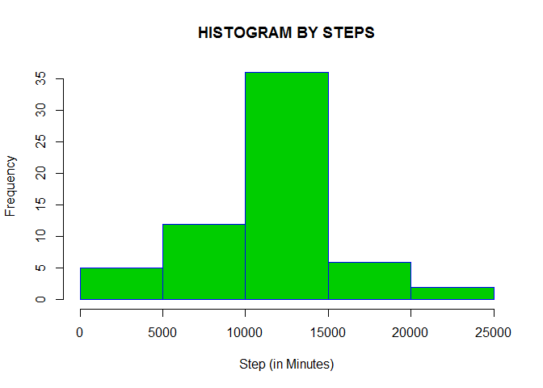
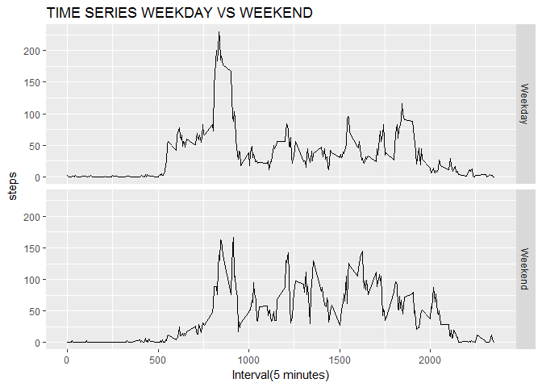

# Reproducible Research: Peer Assessment 1

This report assignment makes use of personal activity monitoring device (like Fitbit and Nike Fuelband). The data source contains 3 parameters, namely, *'steps', 'date'* and *'interval'*. The obtained data from devices is at 5 minute intervals, through out the day and consists of two months of data (October and November, 2012)

This report consists of the following items:

- A. Loading and preprocessing the data
- B. Provide the mean total number of steps taken per day
- C. Provide the average daily activity pattern
- D. Imputing missing values
- E. Are There Differences in Activity Patterns Between Weekdays and Weekends?


## A. Load and Pre-Process data

1. *Data Source: activity.csv .*
2. *Loads and process data source (read.csv(activity.csv)) *


```r
data_activity <- read.csv('activity.csv')
```


## B. What is *Mean Total Number of Steps Taken Per Day?*
*Note: Ignoring the missing values in the dataset; the following is required:*

- To Calculate the total number of steps taken per day
- To Plot a histogram of the total number of steps taken each day
- To Calculate and report the mean and median of the total number of steps taken per day


**1. Calculate the total number of steps taken per day:**


```r
ds <- with(data_activity, aggregate(steps ~ date, data=data_activity, sum))
```


**2. Plot a Histogram of the total number of steps taken each day:**


```r
hist(ds$steps, main ="HISTOGRAM OF STEPS", xlab ="Steps(in Days)", col = 2, border = 4 )
```

<!-- -->


**3. Calculate and Report the Mean and Median of the Total Number of Steps Taken Per Day:**


```r
c(mean = mean(ds$steps), median = median(ds$steps))
```

```
##     mean   median 
## 10766.19 10765.00
```

## C. What is the Average Daily Activity Pattern?

*The following is required*

- Make a time series plot (i.e. type = "l") of the 5-minute interval (x-axis) and the average number of steps taken, averaged across all days (y-axis)


- Which 5-minute interval, on average across all the days in the dataset, contains the maximum number of steps?


**1. A time series plot of the 5-minute interval (x-axis) and the average number of steps taken, averaged across all days (y-axis)**


```r
ds <- aggregate(steps ~ interval, data = data_activity, mean)
with(ds, plot(interval, steps, type ="l"))
```

<!-- -->

**2. Which 5-minute interval, on average across all the days in the dataset that contains the maximum number of steps**  


```r
ds[which.max(ds$steps),]
```

```
##     interval    steps
## 104      835 206.1698
```


## C. Imputing Missing Values
For Imputing Missing Values, there are a number of days/intervals in the activity source with missing values **(coded as NA)**. Thes missing days may introduce bias into some calculations or summaries of the data. *The following is required*

- Calculate and report the total number of missing values in the dataset (i.e. the total number of rows with NAs)

- Devise a strategy for filling in all of the missing values in the dataset. The strategy does not need to be sophisticated. For example, you could use the mean/median for that day, or the mean for that 5-minute interval, etc.

- Create a new dataset that is equal to the original dataset but with the missing data filled in.

- Make a histogram of the total number of steps taken each day and Calculate and report the mean and median total number of steps taken per day. Do these values differ from the estimates from the first part of the assignment? What is the impact of imputing missing data on the estimates of the total daily number of steps?


**1. Calculate and report the total number of missing values in the dataset (i.e. the total number of rows with NAs)** 


```r
filter.na <- is.na(data_activity)
sum(filter.na)
```

```
## [1] 2304
```

**2. Devise a strategy for filling in all of the missing values in the dataset. The strategy does not need to be sophisticated. For example, you could use the mean/median for that day, or the mean for that 5-minute interval, etc.** 


```r
## Obtain The Mean of 5 Minute Interval
mean5minute <- with(data_activity, tapply(steps, interval, mean, na.rm=TRUE))

## Obtain Dataset That Contains 'NA' Steps
data_activity_na <- subset(data_activity, is.na(data_activity))

## Replace the "NA" values with Mean for Each 5 Minute Interval
for(i in 1:nrow(data_activity_na)){
    column_name <- paste(data_activity_na[i, "interval"])
    data_activity_na[i, "steps"] <- mean5minute[column_name]
}

## Preview Sample 'NA' Replacement Values
head(data_activity_na)
```

```
##       steps       date interval
## 1 1.7169811 2012-10-01        0
## 2 0.3396226 2012-10-01        5
## 3 0.1320755 2012-10-01       10
## 4 0.1509434 2012-10-01       15
## 5 0.0754717 2012-10-01       20
## 6 2.0943396 2012-10-01       25
```

**3. Create a new dataset that is equal to the original dataset but with the missing data filled in.**


```r
## create new dataset without NAs
data_activity_wo_na <- rbind(data_activity_na, subset(data_activity, !is.na(data_activity)))

## preview new dataset without na
head(data_activity_wo_na)
```

```
##       steps       date interval
## 1 1.7169811 2012-10-01        0
## 2 0.3396226 2012-10-01        5
## 3 0.1320755 2012-10-01       10
## 4 0.1509434 2012-10-01       15
## 5 0.0754717 2012-10-01       20
## 6 2.0943396 2012-10-01       25
```

**4i. Make a histogram of the total number of steps taken each day.**


```r
ds <- aggregate(steps ~ date, data=data_activity_wo_na, sum)
hist(ds$steps, main="HISTOGRAM BY STEPS", xlab="Step (in Minutes)", col = 3, border = 4)
```

<!-- -->

Calculate and report the mean and median total number of steps taken per day.

```r
c(mean=mean(ds$steps), median=median(ds$steps))
```

```
##     mean   median 
## 10766.19 10766.19
```

**4ii. Do these values differ from the estimates from the first part of the assignment? What is the impact of imputing missing data on the estimates of the total daily number of steps?** 

```{}
YES, the values does differ however, it is very minor, hence therefore, and it does not have any big impact to the analysis.
```

## E. Is There Any Differences In Activity Patterns Between Weekdays and Weekends?

- Create a new factor variable in the dataset with two levels - "weekday" and "weekend" indicating whether a given date is a weekday or weekend day.

- Make a panel plot containing a time series plot (i.e. type = "l") of the 5-minute interval (x-axis) and the average number of steps taken, averaged across all weekday days or weekend days (y-axis).


**1. Create a new factor variable in the dataset with two levels - "weekday" and "weekend" indicating whether a given date is a weekday or weekend day.**


```r
## Load library
library(dplyr)
```

```
## Warning: package 'dplyr' was built under R version 3.3.2
```

```r
## Mutate dataset
data_activity_wo_na <- mutate(data_activity_wo_na, 
                         day=ifelse(weekdays(as.Date(date)) %in% c("Saturday", "Sunday"), "Weekend", "Weekday"))

## cast a new field as factor
data_activity_wo_na <- transform(data_activity_wo_na, day=factor(day))

## verify the new field is in factor
str(data_activity_wo_na)
```

```
## 'data.frame':	52704 obs. of  4 variables:
##  $ steps   : num  1.717 0.3396 0.1321 0.1509 0.0755 ...
##  $ date    : Factor w/ 61 levels "2012-10-01","2012-10-02",..: 1 1 1 1 1 1 1 1 1 1 ...
##  $ interval: int  0 5 10 15 20 25 30 35 40 45 ...
##  $ day     : Factor w/ 2 levels "Weekday","Weekend": 1 1 1 1 1 1 1 1 1 1 ...
```

**2. Make a panel plot containing a time series plot (i.e. type = "l") of the 5-minute interval (x-axis) and the average number of steps taken, averaged across all weekday days or weekend days (y-axis).** The plot is shown below using simulated data:


```r
## Load ggplot library
library(ggplot2)

## Group Dataset by Interval and Day
data_activity_wo_na <- group_by(data_activity_wo_na, interval, day)

## Summarize the Group Data and Calculate Average Steps for Each Group
ds <- summarize(data_activity_wo_na, mean(steps))
colnames(ds) <- c("interval", "day", "steps")

## Plot Graph and Split by Day("Weekday" and "Weekend")
gp <- ggplot(ds, aes(x=interval, y=steps)) + geom_line() + 
    facet_grid(day ~ .) + 
    xlab("Interval(5 minutes)") + 
    ggtitle("TIME SERIES WEEKDAY VS WEEKEND")
gp
```

<!-- -->
